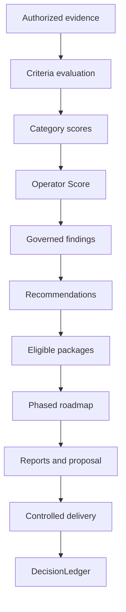

# Operator Intelligence™

> **A governed Business Growth Systems Assessment for contractor and local-service businesses.**

Operator Intelligence converts authorized business evidence into repeatable scores, governed findings, prioritized recommendations, implementation packages, phased roadmaps, client reports, and auditable decisions.

| Product state | Decision | Primary market | Canonical repository |
|---|---|---|---|
| Commercial v1.0 content complete | `ALLOW` — approved for release publication | Contractor and local-service businesses | [`dburt-proex/operator-intelligence`](https://github.com/dburt-proex/operator-intelligence) |

> [!IMPORTANT]
> This page is an orientation and navigation layer. Canonical rules remain in the linked repository files. If this page conflicts with an approved control artifact, the control artifact governs and the conflict must be reviewed.

---

## Start here

| If you want to… | Open |
|---|---|
| Understand the product | [Repository overview](https://github.com/dburt-proex/operator-intelligence/blob/main/README.md) |
| Learn the operating method | [Methodology](https://github.com/dburt-proex/operator-intelligence/blob/main/docs/methodology.md) |
| Run a governed engagement | [Commercial v1.0 usage guide](https://github.com/dburt-proex/operator-intelligence/blob/main/docs/commercial-v1-usage.md) |
| Inspect scoring controls | [Scoring system](https://github.com/dburt-proex/operator-intelligence/tree/main/scoring) |
| Review finding logic | [Finding index](https://github.com/dburt-proex/operator-intelligence/blob/main/framework/finding-index.md) |
| Use client-delivery artifacts | [Template registry](https://github.com/dburt-proex/operator-intelligence/blob/main/templates/index.md) |
| Review the release decision | [Commercial v1.0 completion record](https://github.com/dburt-proex/operator-intelligence/blob/main/COMMERCIAL_V1_COMPLETION.md) |
| See future development | [Roadmap](https://github.com/dburt-proex/operator-intelligence/blob/main/ROADMAP.md) |

---

## What the system does

Operator Intelligence evaluates the operating surfaces that influence how a local-service business becomes visible, earns trust, converts demand, follows up, measures performance, and adopts automation safely.

### Assessment domains

| Growth surface | Evaluation focus |
|---|---|
| Website structure and UX | Access, usability, buyer path, service/location coverage |
| Messaging and offer | Relevance, clarity, differentiation, next-step alignment |
| Conversion | Calls to action, forms, estimate paths, friction, follow-up readiness |
| Local SEO | Search intent coverage, technical/local signals, content gaps |
| Google Business Profile | Completeness, relevance, authority, conversion support |
| Reputation and trust | Reviews, proof, credentials, consistency, risk controls |
| Social presence | Evidence-backed visibility, activity, relevance, trust support |
| Automation | Workflow maturity, handoffs, failure handling, observability |
| AI readiness | Purpose, authority, data, review, escalation, logging, QA |
| Analytics | Measurement coverage, ownership, decision usefulness |
| Competitive position | Observable market comparison without invented competitor claims |

The weighted `messaging_offer` category combines messaging and offer criteria for scoring while preserving separate finding domains for diagnosis and recommendation routing.

---

## Evidence-to-decision architecture



Every material recommendation must preserve this trace:

```text
Evidence
→ Interpretation
→ Business impact
→ Confidence
→ Priority
→ Package eligibility
→ Roadmap phase
→ Action
→ DecisionLedger
```

A recommendation is not valid merely because a service can be sold. Evidence, score weakness, bounded impact, confidence, priority, dependencies, and phase alignment must justify it.

---

## Operator Score

The scoring engine contains **140 unique observable criteria** across **11 weighted categories**. It preserves performance, evidence coverage, confidence, and publication state as separate concepts.

### Core scoring controls

- Approved anchors: `0`, `25`, `50`, `75`, and `100`
- Criterion states: `scored`, `unknown`, `blocked`, and `not_applicable`
- Active category weights must total 100%
- One condition has one weighted owner
- Confidence never changes observed maturity or priority
- Unknown is never converted into a zero
- A blocked result is uncertainty plus a governance condition, not automatic failure
- Approved score objects are immutable and superseded when materially changed
- Publication states include official, provisional, range-only, blocked, and internal-only

For the complete calculation and publication contract, use the [scoring directory](https://github.com/dburt-proex/operator-intelligence/tree/main/scoring).

---

## Governance model

Operator Intelligence applies three decision gates:

| Gate | Meaning |
|---|---|
| **ALLOW** | The bounded artifact or action may advance to the next separate governed decision |
| **REVIEW** | Qualified validation, correction, judgment, or accepted limitation is required |
| **HALT** | Evidence, authority, safety, privacy, scope, dependency, publication, or traceability prevents advancement |

### Non-negotiable boundaries

- Evidence, interpretation, assumptions, and limitations remain distinct.
- Package eligibility precedes package assignment.
- Exactly one primary package exists only for eligible implementation work.
- Phase 0 is validation and access, not implementation.
- QC, publication, roadmap approval, proposal acceptance, and implementation authorization are separate decisions.
- Completion evidence and realized-value evidence are separate.
- AI may not bypass workflow, data, privacy, review, escalation, logging, QA, or failure controls.
- Unsupported financial, lead, conversion, ranking, market, competitor, savings, ROI, and timeline claims are prohibited.
- Material changes supersede approved history; they do not silently overwrite it.
- Real-client work requires fresh evidence, permissions, review, and decisions for that engagement.

See the [standards library](https://github.com/dburt-proex/operator-intelligence/tree/main/standards) and [governance gate index](https://github.com/dburt-proex/operator-intelligence/blob/main/framework/governance-gate-index.md).

---

## Commercial v1.0 inventory

| System layer | Approved inventory |
|---|---:|
| Weighted scoring categories | 11 |
| Unique scoring criteria | 140 |
| Finding libraries | 11 |
| Registered finding patterns | 217 |
| Framework control artifacts | 8 |
| Control standards | 9 |
| Canonical implementation packages | 8 |
| Commercial templates | 15 |
| Operating playbooks | 4 |
| Industry playbooks | 3 |
| Complete sample engagements | 1 |
| Sample engagement artifacts | 10 |
| Research protocols | 4 |
| Production asset specifications | 6 |

The final approval chain and acceptance evidence are recorded in [`COMMERCIAL_V1_COMPLETION.md`](https://github.com/dburt-proex/operator-intelligence/blob/main/COMMERCIAL_V1_COMPLETION.md).

---

## Canonical implementation packages

Packages are controlled delivery containers, not automatic recommendations.

| Package ID | Canonical package |
|---|---|
| `OI-PKG-WEB-001` | Website Conversion Fix Pack |
| `OI-PKG-SEO-001` | Local SEO Expansion Pack |
| `OI-PKG-GBP-001` | Google Business Authority Pack |
| `OI-PKG-TRUST-001` | Trust Proof System |
| `OI-PKG-CRM-001` | CRM and Follow-Up System |
| `OI-PKG-REV-001` | Review Generation System |
| `OI-PKG-DASH-001` | Operator Dashboard Pack |
| `OI-PKG-AI-001` | Governed AI Intake Assistant |

Use the [package catalog](https://github.com/dburt-proex/operator-intelligence/blob/main/templates/package-catalog.md) for scope, eligibility, exclusions, dependencies, acceptance evidence, and authorization boundaries.

---

## Run an assessment

1. Qualify the business and intended decision.
2. Complete discovery and governed intake.
3. Define scope, exclusions, authority, access, testing, and data rules.
4. Map public and authorized internal surfaces.
5. Capture, validate, and admit evidence.
6. Score applicable criteria and preserve unknown or blocked states.
7. Resolve findings and duplicate ownership.
8. Apply risk, impact, opportunity, effort, confidence, and priority logic.
9. Route only package-eligible recommendations.
10. Build Phase 0 and phases 1–5 of the roadmap.
11. Assemble executive and contractor reports.
12. Complete QC and issue a separate publication decision.
13. Record client decisions.
14. Propose only bounded, eligible implementation scope.
15. Obtain separate onboarding and implementation authorization.
16. Validate completion, monitor realized value separately, then renew or close.

Use the [commercial operating guide](https://github.com/dburt-proex/operator-intelligence/blob/main/docs/commercial-v1-usage.md) as the canonical execution sequence.

---

## Repository map

| Directory | Authority |
|---|---|
| [`methodology/`](https://github.com/dburt-proex/operator-intelligence/tree/main/methodology) | Product foundations and assessment method |
| [`framework/`](https://github.com/dburt-proex/operator-intelligence/tree/main/framework) | Findings, routing, risk, effort, opportunity, ROI, lifecycle, gates |
| [`scoring/`](https://github.com/dburt-proex/operator-intelligence/tree/main/scoring) | Criteria, weights, category sheets, score objects, fixtures |
| [`standards/`](https://github.com/dburt-proex/operator-intelligence/tree/main/standards) | Evidence, confidence, routing, publication, QC, AI, DecisionLedger |
| [`templates/`](https://github.com/dburt-proex/operator-intelligence/tree/main/templates) | Intake, evidence, reports, roadmap, proposal, delivery, QC |
| [`playbooks/`](https://github.com/dburt-proex/operator-intelligence/tree/main/playbooks) | Operating workflows and contractor-industry variants |
| [`examples/`](https://github.com/dburt-proex/operator-intelligence/tree/main/examples) | Governed fictional regression engagement |
| [`research/`](https://github.com/dburt-proex/operator-intelligence/tree/main/research) | Market, competitor, conversion, and SEO support protocols |
| [`assets/`](https://github.com/dburt-proex/operator-intelligence/tree/main/assets) | Design, score, report, roadmap, diagram, and brand specifications |
| [`docs/`](https://github.com/dburt-proex/operator-intelligence/tree/main/docs) | Commercial use, methodology, readiness, and operating documentation |

---

## Example engagement

The repository includes a complete fictional painting-contractor engagement for **Northstar Painting Co.** It demonstrates:

- provisional Operator Score indicator: **50**
- uncertainty range: **34–67**
- weighted evidence coverage: **86.5%**
- Operator confidence index: **0.779**
- social state preserved as unknown
- no invented social finding
- AI package route set to `HALT`
- implementation authorization set to `false`

This example is synthetic regression evidence. It must never be represented as evidence about a real business.

[Open the sample engagement →](https://github.com/dburt-proex/operator-intelligence/tree/main/examples/sample-painting-contractor)

---

## Release boundary

Commercial v1.0 is approved as a governed consulting-product repository and may advance to tag and GitHub release publication under decision `OI-COMMERCIAL-V1-APPROVAL-001`.

The approval does **not** authorize a particular client assessment, data use, report publication, proposal, implementation, trademark use, distribution term, or outcome claim. Those require their own evidence and governed decisions.

---

## Ownership and contribution control

Operator Intelligence is maintained by [Drew Burt](https://github.com/dburt-proex). Material changes to scoring, finding IDs, recommendation priority, package routing, roadmap phases, standards, template schemas, commercial claims, or release scope must reopen the applicable control gate and create a DecisionLedger record.

For current release state and controlled expansion, use the [roadmap](https://github.com/dburt-proex/operator-intelligence/blob/main/ROADMAP.md) and [changelog](https://github.com/dburt-proex/operator-intelligence/blob/main/CHANGELOG.md).
