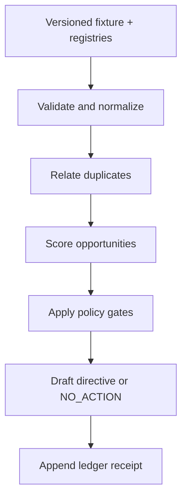

# Advisory Data Flow

**Version:** 0.1.0  
**Stage:** Phase 0 contract  
**Folder alignment:** `leverage-engine/architecture/`

## Purpose

Define the deterministic static-fixture flow and the records changed during an advisory run.

The run reads configuration and fixture records. It writes only an optional local output document and an idempotent JSONL ledger entry. Source records remain present when duplicates are identified.

## Deterministic ordering

Candidates sort by gate eligibility, confidence factor, evidence quality, lower friction, then stable opportunity ID. Exact duplicates are suppressed by stable fingerprint before selection. All timestamps used in output come from the fixture.

## Completion evidence

The CLI exit code, output hash, selected directive or `NO_ACTION`, gate reasons, and ledger receipt together form the run completion evidence.
