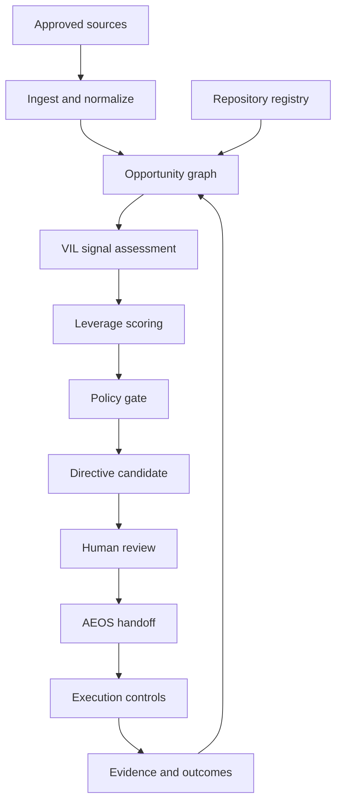
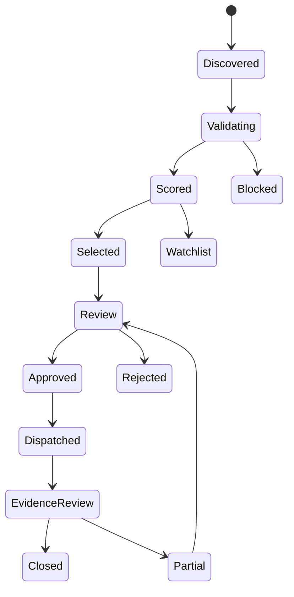

# Leverage Engine Build Specification

**Version:** 0.1.0  
**Status:** Proposed / planning complete / implementation not started  
**Parent system:** Operator Intelligence  
**Subsystem alignment:** Cross-project opportunity prioritization  
**Source baseline:** Operator Intelligence black-box transfer, Stage 3A complete and Stage 3B active  
**Decision owner:** Drew Burt  

## 1. Decision

Build the Leverage Engine as a first-class Operator Intelligence subsystem with a strict internal boundary.

It will determine the highest-leverage evidence-backed action available across Drew's governed project ecosystem. Its first release will be advisory only: it may inspect approved sources, normalize and score opportunities, generate one directive candidate, and record its reasoning. It may not dispatch an agent, modify a repository, publish content, spend money, or perform an external action without human approval and downstream controls.

The Leverage Engine must not interrupt or dilute Operator Intelligence Stage 3B scoring work. Planning can proceed now. Repository implementation should begin as a separate, narrow folder group only after the subsystem charter and placement are approved.

## 2. Mission and measurable outcome

### Mission

Continuously answer:

> Given current external signals, repository state, active goals, constraints, evidence, and prior outcomes, what is the single highest-leverage action Drew should take next?

### Primary users

- Drew Burt, final decision owner and approval authority
- Governed build agents, which consume approved directives
- Repository maintainers, who provide project state and validate proposed changes
- Audit/review users, who inspect evidence, scoring, decisions, overrides, and outcomes

### Measurable outcome

Each valid run produces:

1. a traceable set of normalized opportunities;
2. a deterministic priority ranking;
3. one selected directive candidate or an explicit `NO_ACTION` result;
4. an ALLOW, REVIEW, or HALT gate result;
5. a human-readable rationale tied to evidence;
6. a DecisionLedger record; and
7. an outcome-measurement contract for later realized-value review.

## 3. Scope

### Included

- Daily opportunity discovery from approved external and internal sources
- Approved repository-state inspection
- Cross-project dependency and duplication analysis
- Evidence-quality and confidence assessment
- Opportunity graph maintenance
- Leverage scoring and deterministic ranking
- Directive generation
- Queue and lifecycle management
- Outcome evidence, realized-value, and lesson capture
- Governed handoff to AEOS after approval

### Explicit exclusions for MVP

- Autonomous repository writes or pull requests
- Autonomous email, social, sales, job-application, purchasing, or financial actions
- Runtime tool execution outside read-only inspection
- Replacement of Operator Score or client-assessment scoring
- Replacement of VIL signal scoring, AEOS orchestration, PromptBP instruction control, DiffWall change governance, CASA runtime governance, or Mirdexx evidence retention
- Unsupported ROI, revenue, market-demand, hiring, or completion claims
- Self-modifying weights, policies, permissions, or prompts

## 4. System boundaries

| System | Owns | Does not own |
|---|---|---|
| Operator Intelligence | Assessment evidence, readiness, findings, and recommendation context | Cross-project execution or runtime authorization |
| Leverage Engine | Cross-project candidate generation, leverage ranking, directive selection, and queue state | Task execution or safety enforcement |
| VIL | Signal relevance, evidence strength, confidence, and routing features | Final leverage decision |
| AEOS | Execution planning, decomposition, scheduling, and agent routing | Strategic priority selection |
| PromptBP | Instruction contracts and execution constraints | Opportunity selection |
| DiffWall | Change-time repository risk evaluation | External-market or portfolio prioritization |
| CASA | Runtime permission and action governance | Strategic prioritization |
| Mirdexx | Durable evidence, memory, outcomes, and lessons | Final authority to approve action |
| DecisionLedger | Canonical decision and override history | Source discovery or task execution |

## 5. Architecture



The feedback loop may update evidence, outcomes, lessons, and future priority features. It may not silently rewrite prior records, weights, policies, or approvals.

## 6. Components

| Component | Single responsibility | Owner type | MVP mode |
|---|---|---|---|
| Source Registry | Declare authorized sources, access mode, freshness, and retention | Human-approved config | Static |
| Repository Registry | Declare canonical repositories, roles, state adapters, and routing restrictions | Human-approved config | Static |
| Ingestion Adapter | Acquire read-only source records and preserve provenance | System | Fixture/manual input first |
| Normalizer | Convert source records into canonical signals | System | Deterministic |
| Evidence Validator | Check provenance, timestamps, required fields, and contradictions | System + reviewer | Deterministic rules |
| Duplicate Resolver | Merge or relate materially identical signals and tasks | System | Deterministic fingerprint plus review |
| Opportunity Graph | Relate signals, assets, dependencies, opportunities, directives, and outcomes | System of record | File-backed MVP |
| Repository State Analyzer | Identify unfinished, stale, duplicate, blocked, or commercially close work | System | Read-only |
| VIL Adapter | Produce relevance, evidence-quality, confidence, and priority features | VIL contract | Contract stub first |
| Leverage Scorer | Calculate raw value, friction, risk, confidence, and final index | System | Deterministic |
| Policy Router | Return ALLOW, REVIEW, or HALT with required next gate | Policy owner | Deterministic |
| Directive Generator | Produce a bounded action contract for the selected opportunity | System | Template-based |
| Queue Manager | Maintain opportunity and directive lifecycle state | System | File-backed MVP |
| Outcome Evaluator | Compare expected outcomes with retained completion evidence | Human + system | Later phase |
| Ledger Adapter | Append decision, override, approval, and outcome records | DecisionLedger | Append-only |

## 7. Canonical records

### 7.1 Signal record

Required fields:

```yaml
signal_id: LE-SIG-YYYY-NNNN
source_id: string
source_type: news | funding | hiring | enterprise_adoption | startup | github | repository | user_directive
observed_at: timestamp
retrieved_at: timestamp
title: string
summary: string
evidence_refs: [uri_or_record_id]
affected_assets: [asset_id]
freshness_state: current | aging | stale | unknown
evidence_quality: 0_to_100
confidence: high | medium | low | unknown
validation_state: validated | validation_required | contradicted | blocked
```

### 7.2 Repository-state record

```yaml
snapshot_id: LE-REP-YYYY-NNNN
repository_id: string
canonical_ref: string
commit_sha: string
captured_at: timestamp
inspection_scope: [paths_or_metadata]
unfinished_items: [record_id]
blocked_items: [record_id]
duplicate_candidates: [record_id]
stale_candidates: [record_id]
evidence_gaps: [record_id]
commercial_assets: [asset_id]
routing_restrictions: [rule_id]
```

No repository claim is valid without a commit SHA or an explicit `snapshot_unverified` state.

### 7.3 Opportunity record

```yaml
opportunity_id: LE-OPP-YYYY-NNNN
objective: string
opportunity_type: revenue | career | product | portfolio | maintenance | evidence | risk_reduction
supporting_signals: [signal_id]
target_assets: [asset_id]
dependencies: [record_id]
duplicates: [opportunity_id]
expected_outcome: string
success_evidence: [evidence_requirement]
raw_value_score: 0_to_100
friction_score: 0_to_100
risk_score: 0_to_100
confidence_factor: 0_to_1
urgency_bonus: 0_to_10
leverage_index: 0_to_100
gate_result: ALLOW | REVIEW | HALT
gate_reasons: [rule_id]
state: opportunity_state
```

### 7.4 Leverage Directive

```yaml
directive_id: LD-YYYY-MM-DD-NNN
run_id: LE-RUN-YYYY-NNNN
selected_opportunity_id: LE-OPP-YYYY-NNNN
objective: string
target_system: string
proposed_action: string
evidence_refs: [record_id]
score_summary: object
assumptions: [string]
dependencies: [record_id]
allowed_actions: [string]
prohibited_actions: [string]
review_owner: string
approval_state: draft | approved | rejected | expired
expires_at: timestamp
expected_outcome: string
completion_evidence: [evidence_requirement]
rollback_or_recovery: string
ledger_record_id: string
```

Every directive must be bounded, expiring, attributable, evidence-backed, and independently reviewable.

### 7.5 Outcome record

```yaml
outcome_id: LE-OUT-YYYY-NNNN
directive_id: string
completion_state: completed | partial | blocked | failed | abandoned
observed_results: [evidence_ref]
expected_vs_actual: string
realized_value_state: verified | partially_verified | unverified | disproven
lesson: string
future_priority_effect: none | raise | lower | suppress_duplicate
reviewed_by: string
reviewed_at: timestamp
```

## 8. Opportunity graph

### Node types

- `signal`
- `repository`
- `asset`
- `capability`
- `goal`
- `opportunity`
- `directive`
- `task`
- `artifact`
- `evidence`
- `outcome`
- `lesson`

### Edge types

- `supports`
- `contradicts`
- `affects`
- `depends_on`
- `duplicates`
- `supersedes`
- `targets`
- `creates`
- `executed_by`
- `validated_by`
- `realizes_value_for`
- `changes_priority_of`

All edges require provenance, creation time, creator, and confidence. Deleting a historical edge is prohibited; corrections supersede it.

## 9. Leverage scoring model

The Leverage Engine score is separate from the Operator Score.

### 9.1 Raw value score

| Factor | Weight | Question |
|---|---:|---|
| Revenue proximity | 25% | Can this produce or materially advance near-term revenue? |
| Existing asset leverage | 20% | How much current IP, code, evidence, or distribution does it reuse? |
| Evidence-backed demand | 15% | Is demand supported by current, authoritative evidence? |
| Strategic alignment | 15% | Does it advance an approved objective or product boundary? |
| Time to value | 10% | How quickly can a verifiable outcome be reached? |
| Compounding value | 10% | Will the result improve future runs, assets, or reusable capability? |
| Career/market signal | 5% | Will it materially improve credible employment or buyer signal? |

Each factor uses explicit 0, 25, 50, 75, or 100 anchors. Interpolation is prohibited until a factor rubric authorizes it.

### 9.2 Friction score

| Factor | Weight |
|---|---:|
| Effort | 35% |
| Technical complexity | 25% |
| External dependencies | 20% |
| Maintenance burden | 20% |

### 9.3 Risk score

| Factor | Weight |
|---|---:|
| Authority and external impact | 30% |
| Data security and privacy | 25% |
| Financial and legal exposure | 25% |
| Irreversibility | 20% |

### 9.4 Confidence factor

Proposed defaults:

| Confidence | Factor |
|---|---:|
| High | 1.00 |
| Medium | 0.75 |
| Low | 0.50 |
| Unknown | 0.00 |

Confidence measures support for the opportunity claim, not the quality of the opportunity itself.

### 9.5 Formula

```text
Leverage Index = clamp(
  (Raw Value Score × Confidence Factor)
  - (Friction Score × 0.20)
  - (Risk Score × 0.20)
  + Urgency Bonus,
  0,
  100
)
```

The urgency bonus is 0 to 10 and requires a verified external deadline or time-bounded window. Personal preference alone cannot create an urgency bonus.

The formula is a proposed calibration baseline, not a validated predictive model. It must be fixture-tested and reviewed before production use.

### 9.6 Selection rules

- Unknown confidence routes to validation, never execution.
- Low confidence cannot become the daily directive unless the directive is itself an evidence-gathering task.
- A G4 boundary always overrides score.
- The engine may return `NO_ACTION` when no candidate clears policy and evidence gates.
- A human may override the ranking only with a recorded rationale, owner, time, and expected outcome.
- One candidate is selected per run. The next two may be retained as a watchlist but are not dispatched.

## 10. Governance gates

| Gate | ALLOW | REVIEW | HALT |
|---|---|---|---|
| Source intake | Authorized, traceable, timestamped source | Partial provenance, freshness concern, or ambiguous rights | Prohibited source, credential misuse, or unapproved sensitive data |
| Opportunity validation | Required evidence present and materially consistent | Missing corroboration, conflict, or incomplete repository state | Fabricated, deceptive, or legally restricted premise |
| Scoring | Schema-valid inputs and complete rubric values | Material unknowns or uncalibrated category | Score manipulation, missing audit record, or invalid formula version |
| Selection | Policy-safe candidate with sufficient confidence | Tied ranking, material dependency, high impact, or human judgment required | G4 boundary, unauthorized target, or unresolved contradiction |
| Directive generation | Bounded, reversible, owned, measurable action | Scope ambiguity, cross-repository effect, or weak completion evidence | Destructive, deceptive, unowned, or nonrecoverable action |
| Dispatch | Human-approved MVP directive and valid downstream contract | New permission, external impact, or changed state since approval | Expired approval, missing authority, failed DiffWall/CASA gate |
| Outcome closure | Completion evidence and reviewer sign-off | Partial result or uncertain realized value | False completion claim or missing mandatory evidence |

MVP policy result: every executable directive is `REVIEW` until Drew approves it. `ALLOW` means eligible to present for review, not permission to execute.

## 11. State model



`Expired`, `Superseded`, and `Duplicate` are terminal states. Reopening creates a new version linked to the prior record.

## 12. End-to-end workflow

1. Start a run with a unique run ID, policy version, scoring version, source registry version, and repository registry version.
2. Read only approved external signals and approved repository snapshots.
3. Normalize inputs and retain provenance.
4. Reject, quarantine, or route malformed and untrusted content for review.
5. Resolve exact duplicates and relate near-duplicates without erasing source records.
6. Update the opportunity graph.
7. Generate candidate opportunities from signal-to-asset matches and repository gaps.
8. Apply VIL relevance, evidence-quality, and confidence features.
9. Calculate raw value, friction, risk, confidence, urgency, and Leverage Index.
10. Apply policy gates and rank eligible candidates deterministically.
11. Generate one directive candidate or `NO_ACTION`.
12. Record the decision, rejected alternatives, assumptions, and gate outcome.
13. Present the directive for human review.
14. On approval, create a versioned AEOS handoff; downstream controls govern execution.
15. Capture completion evidence, realized-value status, and lessons without rewriting historical decisions.

## 13. Permissions and data controls

### MVP permissions

- Read approved public sources
- Read approved repository metadata and allowlisted paths
- Write only Leverage Engine run records, queue records, and draft directives
- Append DecisionLedger entries
- Present directive candidates to Drew

### Prohibited MVP permissions

- Repository mutation
- Pull-request publication
- External messages or applications
- Financial transactions
- Secret collection or credential reuse outside configured adapters
- Sensitive personal, client, or customer data ingestion without an approved policy
- Autonomous policy, weight, prompt, or permission changes

### Logging

Retain run ID, timestamps, source IDs, repository commit SHAs, normalized inputs, formula and policy versions, scores, gate decisions, concise rationales, overrides, approvals, dispatch receipts, errors, and outcome evidence. Do not store hidden chain-of-thought. Store only reviewable decision rationale and cited evidence.

## 14. Failure modes and recovery

| Failure mode | Detection | Containment | Recovery / escalation |
|---|---|---|---|
| Stale external signal | Freshness threshold fails | Exclude from selection | Refresh or mark stale |
| Repository snapshot drift | HEAD differs from recorded SHA | Invalidate directive | Reinspect and rescore |
| Duplicate opportunity | Fingerprint or graph similarity match | Suppress duplicate dispatch | Merge evidence; reviewer confirms |
| Prompt injection in source | Untrusted instruction pattern or policy violation | Treat as data; quarantine | Manual evidence review |
| Contradictory evidence | Conflict rule fires | Route REVIEW | Add authoritative source or narrow claim |
| Missing evidence | Required field or coverage gate fails | Generate validation task | Acquire evidence; rerun |
| Score tie | Equal index within configured tolerance | No automatic winner | Human review using stated tie-breakers |
| Formula/config drift | Unrecognized version or checksum mismatch | HALT scoring | Restore approved version |
| Partial execution | Expected state delta is incomplete | Stop downstream work | CASA exception/HITL and recovery plan |
| False completion claim | Missing completion evidence | Prevent closure | Evidence review or mark unverified |
| Ledger write failure | Append receipt missing | Do not dispatch | Retry safely or HALT for review |
| Source outage | Adapter health failure | Continue with declared partial coverage only | Mark run provisional or `NO_ACTION` |

## 15. Proposed repository layout

```text
leverage-engine/
├── README.md
├── architecture/
│   ├── system-boundaries.md
│   ├── data-flow.md
│   └── authority-model.md
├── config/
│   ├── source-registry.yaml
│   ├── repository-registry.yaml
│   ├── scoring-profile.yaml
│   └── policy-profile.yaml
├── schemas/
│   ├── signal.schema.json
│   ├── repository-state.schema.json
│   ├── opportunity.schema.json
│   ├── directive.schema.json
│   └── outcome.schema.json
├── policies/
│   ├── gates.md
│   ├── permissions.md
│   └── retention.md
├── src/leverage_engine/
│   ├── normalize.py
│   ├── deduplicate.py
│   ├── graph.py
│   ├── score.py
│   ├── route.py
│   ├── directive.py
│   └── ledger.py
├── fixtures/
│   ├── daily-run-valid/
│   ├── unknown-heavy/
│   ├── duplicate-signals/
│   ├── stale-repository/
│   └── g4-halt/
└── tests/
```

This tree is a target map, not authorization to create all files in one build run. The Operator Intelligence one-folder, narrow-commit discipline remains in force.

## 16. Phased build plan

### Phase 0: Charter and contracts

**Objective:** Lock responsibility, scope, authority, and records before runtime work.

Deliverables:

- Subsystem README/charter
- Boundary map
- Canonical record schemas
- Repository and source registry formats
- Scoring profile and policy-gate specification

Exit gate:

- No ownership collision with Operator Score, VIL, AEOS, CASA, DiffWall, PromptBP, Mirdexx, or DecisionLedger
- Drew approves subsystem placement and advisory-only authority

### Phase 1: Smallest end-to-end proof

**Objective:** Prove deterministic selection using static fixtures.

Input:

- Three curated signals
- Two repository-state fixtures
- One approved goal profile

Output:

- Ranked opportunities
- One directive candidate or `NO_ACTION`
- Gate decision
- DecisionLedger record

Exit gate:

- Repeated runs produce identical order and records
- Low/unknown-confidence opportunities cannot reach execution
- No write or external-action capability exists

### Phase 2: Repository intelligence

**Objective:** Add read-only inspection of approved repositories.

Deliverables:

- Canonical repository registry
- Snapshot adapter with commit SHA capture
- Detectors for unfinished work, stale claims, duplication, evidence gaps, dependencies, and commercially close assets
- CASA repositories excluded until a canonical repository is approved

Exit gate:

- Every repository claim is traceable to a snapshot
- Routing allowlist and prohibited targets pass tests

### Phase 3: External opportunity discovery

**Objective:** Add scheduled source adapters without weakening provenance.

Deliverables:

- News, funding, hiring, enterprise adoption, startup, and GitHub adapters
- Freshness and corroboration rules
- Injection-resistant normalization
- Source health and partial-coverage reporting

Exit gate:

- No untraceable or stale signal can produce an executable directive
- Outages produce provisional runs or `NO_ACTION`, not fabricated completeness

### Phase 4: Opportunity graph and realized value

**Objective:** Compound decisions and outcomes across runs.

Deliverables:

- Durable graph storage
- Outcome evaluator
- Realized Value Register integration
- Lesson and future-priority records
- Supersession and duplicate-suppression logic

Exit gate:

- Historical records remain immutable
- Expected and realized value are visibly distinct
- Lessons influence future features only through versioned, reviewable rules

### Phase 5: Governed AEOS handoff

**Objective:** Turn approved directives into constrained execution contracts.

Deliverables:

- PromptBP-compatible directive package
- AEOS handoff schema
- DiffWall and CASA gate receipts
- Partial-execution and rollback handling

Exit gate:

- Human approval is verifiable and unexpired
- Downstream systems reject scope expansion
- Execution results return completion evidence to the ledger

### Phase 6: Controlled automation

**Objective:** Permit narrowly scoped automatic actions only after evidence supports reliability.

Preconditions:

- Sufficient fixture and production-run calibration
- Stable false-positive and override review
- Explicit permission profiles by action class
- Tested containment, rollback, and kill switch
- Human-approved automation policy

No Phase 6 capability is implied by completion of earlier phases.

## 17. Test plan

### Determinism

- Same inputs and versions produce the same ranking, gate result, and directive body.
- Sorting uses explicit tie-breakers: gate eligibility, confidence, evidence quality, lower friction, then stable opportunity ID.

### Schema and policy

- Reject missing provenance, invalid scores, unknown enum values, expired approvals, and unregistered targets.
- Verify weights total 100 within each profile.
- Verify unknown is not treated as zero performance.
- Verify confidence is distinct from opportunity value.

### Governance

- G4 fixtures always HALT regardless of score.
- MVP dispatch without human approval always fails.
- Repository writes and external actions are absent or denied.
- Override records require owner, rationale, timestamp, and expected outcome.

### Adversarial

- Prompt injection embedded in articles, READMEs, issues, or job posts is treated as untrusted content.
- Conflicting and stale sources cannot silently resolve to high confidence.
- Inflated ROI statements cannot enter expected-value fields without evidence and assumptions.
- Duplicate signals cannot create duplicate directives.

### End-to-end acceptance

- Valid fixture produces one reviewable directive and a complete ledger trace.
- Unknown-heavy fixture produces validation work or `NO_ACTION`.
- Duplicate fixture produces one opportunity with preserved source links.
- Stale-repository fixture invalidates selection.
- G4 fixture produces HALT and no handoff.

## 18. Definition of done for advisory MVP

- All canonical schemas validate.
- Scoring and gate profiles are versioned and pass weight checks.
- At least five governed fixtures pass, including valid, unknown-heavy, duplicate, stale, and G4 cases.
- One CLI or equivalent entry point runs a complete static-fixture cycle.
- The output contains ranking, selection, rationale, assumptions, evidence refs, gate result, and ledger receipt.
- Repeated execution is deterministic.
- No autonomous mutation or external-action path exists.
- Documentation states ownership boundaries and recovery behavior.
- A second qualified evaluator can inspect the same inputs and understand why the selected directive won.

## 19. Architecture-changing unknowns and recommended defaults

| Unknown | Why it matters | Recommended default |
|---|---|---|
| Canonical DecisionLedger location | Determines write contract and replay ownership | Use the shared ledger interface; keep a file-backed adapter for MVP |
| Canonical Mirdexx repository and storage contract | Determines outcome and memory persistence | Treat Mirdexx as an external adapter until canonical identity is approved |
| AEOS handoff contract | Determines Phase 5 interface | Define schema now; use a no-op/mock adapter through Phase 4 |
| Source access and retention rights | Affects privacy, cost, and compliance | Public/read-only sources only in MVP; retain metadata and citations, not unnecessary full content |
| Objective weighting by day | Can change which opportunity wins | Use one human-approved objective profile per run; no self-adjustment |
| Automation authority | Changes risk classification and controls | Advisory-only until separate Phase 6 approval |
| Production storage engine | Affects concurrency, replay, and deployment | File-backed JSONL/SQLite proof first; select durable graph storage only after usage evidence |

## 20. Ordered implementation backlog

Each item is a separate narrow build run unless an approved coherent chunk is explicitly authorized.

1. Create `leverage-engine/README.md` with mission, boundaries, MVP authority, and v1 connection.
2. Create `leverage-engine/architecture/system-boundaries.md`.
3. Create the five canonical JSON schemas, one schema per run or one explicitly approved schema chunk.
4. Create source and repository registry specifications.
5. Create scoring anchors and a versioned scoring profile.
6. Create the governance gate and permission profiles.
7. Create static valid and G4 fixtures.
8. Implement schema validation.
9. Implement deterministic scoring and tie-breaks.
10. Implement directive generation and file-backed ledger append.
11. Add the first end-to-end fixture runner.
12. Add unknown-heavy, duplicate, and stale-snapshot fixtures.
13. Validate advisory MVP acceptance criteria.
14. Only then begin live read-only repository adapters.

## 21. Immediate next gate

**Decision required before implementation:** approve the Leverage Engine as an isolated top-level subsystem folder in `dburt-proex/operator-intelligence`, without changing the active Stage 3B scoring files or commercial assessment semantics.

**First safe commit after approval and repository access:**

```text
Path: leverage-engine/README.md
Commit: docs(leverage-engine): define subsystem charter and authority boundary
Scope: one file; no runtime, scoring, or repository behavior changes
```

## Build Run Summary

**Active folder:** Planning artifact outside repository  
**Selected file:** `leverage-engine-build-spec-v0.1.md`  
**Status:** Created / Proposed  
**Phase alignment:** Pre-Phase 0 architecture; Operator Intelligence Stage 3B remains active  
**Files changed:** One planning artifact; no repository files changed  
**Decisions made:** Isolated subsystem, advisory-only MVP, deterministic selection, human approval before dispatch, separate Leverage Index  
**Governance checks:** Boundaries assigned; ALLOW/REVIEW/HALT defined; unknown and confidence separated; audit and recovery specified  
**Remaining gaps:** Canonical repository inspection, subsystem placement approval, shared ledger contract, Mirdexx identity, AEOS handoff contract, calibration evidence  
**Completion status:** Mapping and implementation plan complete; build not started  
**Next recommended build task:** Create the single-file subsystem charter after repository access is restored and placement is approved
